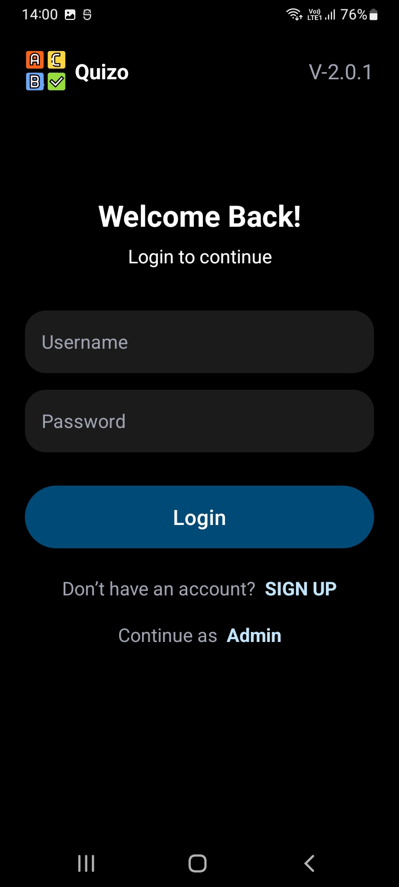
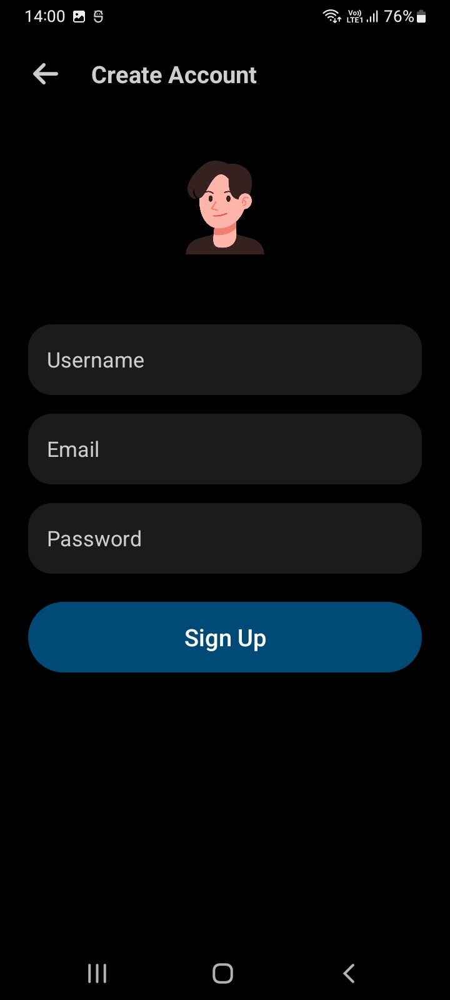
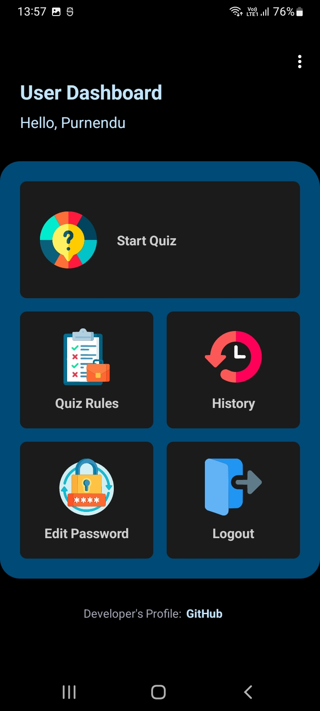
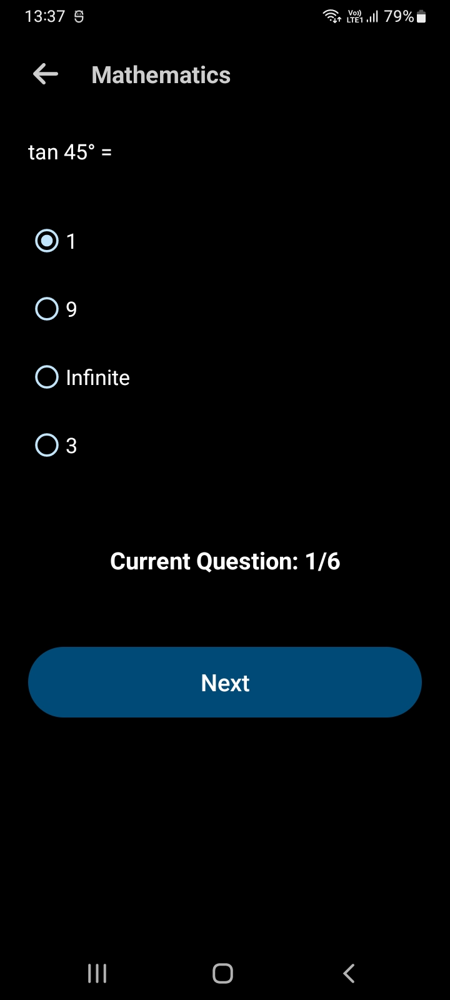
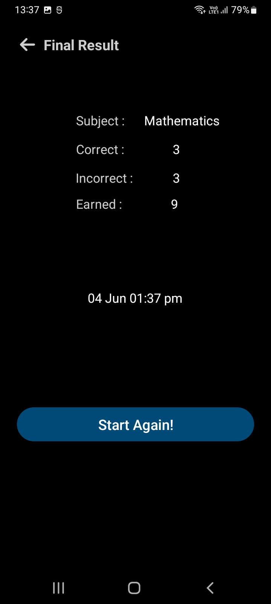
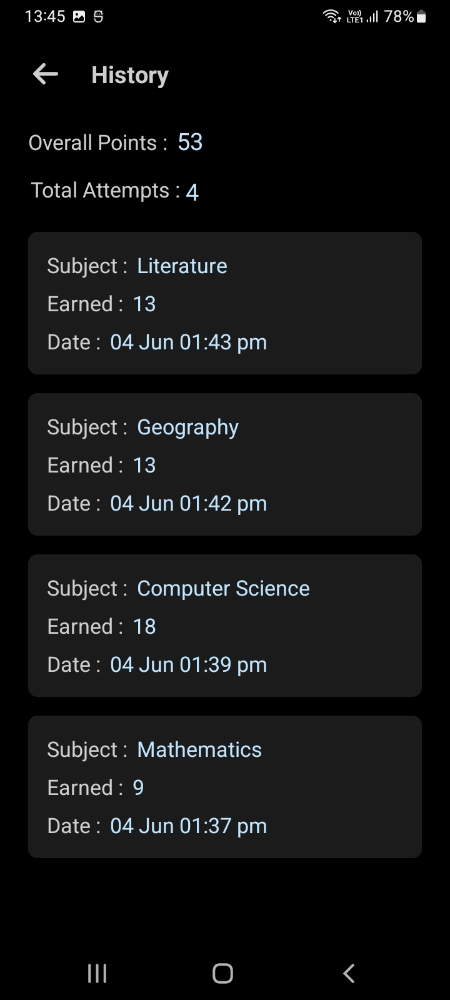
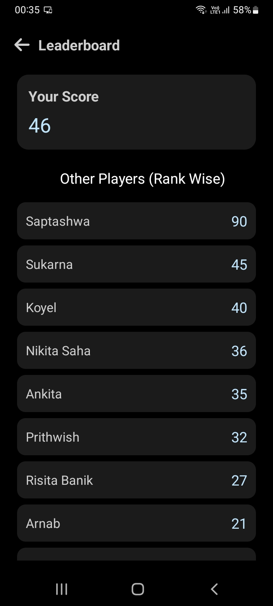
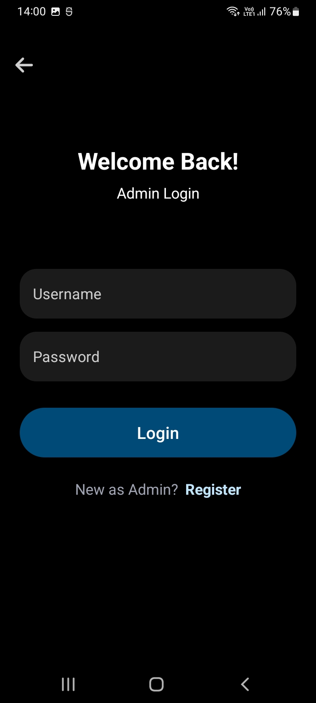
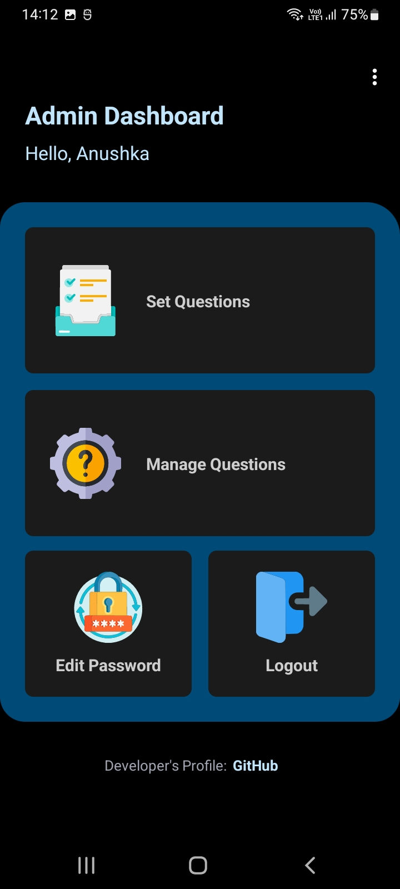
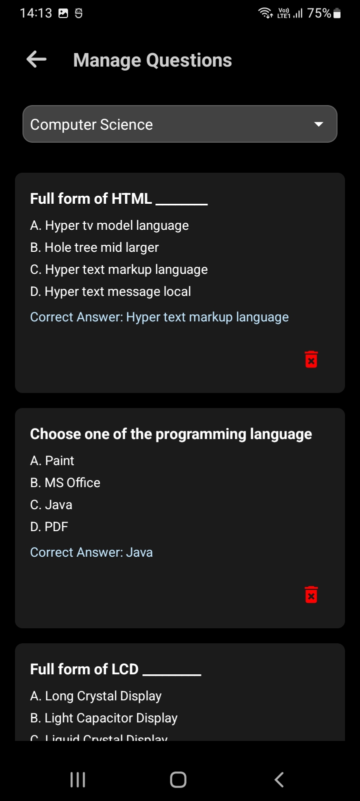

# Getting Started
  ✅ Android version must be 7.0 (Nougat) or above <br><br>
  ✅ This app is optimized for smartphones. User experience on tablets may be suboptimal and it does not support wearable devices <br><br>
  ✅ To access this app, you'll need to simply download and install the apk file <br><br>

# Visit Website


👉 Scan the above QR or <a href="https://quizo-app.tiiny.site/" target="blank">Click here</a> to visit


## Get APK for Android: [Download Here](https://quizo-app.tiiny.site/android/app/Quizo.apk)

# Features
  🌟 Registration and login functionalities for both students and administrators. <br><br>
  🌟 Administrators have the capability to set up, manage, and organize quiz questions for different subjects. <br><br>
  🌟 Students can monitor their individual performance and track their progress over time, including access to a leaderboard. <br><br>
  🌟 Students can take quizzes in Computer Science, Mathematics, Geography, and Literature primarily. <br><br>
  🌟 Biometric or device lock authentication is required to change the password for student/admin accounts. <br><br>

# Technology Used
  ➡️ Java used as main programming language <br><br>
  ➡️ Room Database (Based on SQLite) for local database functionality <br><br>
  ➡️ Firebase Firestore for centralized leaderboard functionality <br><br>
  ➡️ HTML used for displaying web related exceptions <br><br>
  

# Dependencies
```sh
gradle 8.14.1
agp 8.8.2
dotsindicator 4.2
firebaseBom 33.14.0
googleServices 4.4.2
gson 2.10.1
appcompat 1.7.0
material 1.12.0
roomKtx 2.7.1
roomRuntime 2.7.1
activity 1.10.1
constraintlayout 2.2.1
```

# Important Notes on google-services.json
  ➡️ I just added a dummy google-services.json file for your reference only. You need to configure your own google-services.json file from firebase console if you want to integrate firebase in your project <br><br>
  ➡️ If you need help to integrate firebase in your project then checkout this video [Getting started with Firebase](https://youtu.be/jbHfJpoOzkI) <br><br>
  ➡️ You can also refer [Firebase Documentation](https://firebase.google.com/docs/android/setup) <br><br>

# Screenshots
<table>
  <tr>
    <td></td>
    <td></td>
    <td></td>
  </tr>
  <tr>
    <td></td>
    <td></td>
    <td></td>
  </tr>
  <tr>
    <td></td>
    <td></td>
    <td></td>
  </tr>
  <tr>
    <td></td>
    <td></td>
    <td></td>
  </tr>
</table>

# License
```
MIT License

Copyright (c) 2025 Purnendu Guha

Permission is hereby granted, free of charge, to any person obtaining a copy
of this software and associated documentation files (the "Software"), to deal
in the Software without restriction, including without limitation the rights
to use, copy, modify, merge, publish, distribute, sublicense, and/or sell
copies of the Software, and to permit persons to whom the Software is
furnished to do so, subject to the following conditions:

The above copyright notice and this permission notice shall be included in all
copies or substantial portions of the Software.

THE SOFTWARE IS PROVIDED "AS IS", WITHOUT WARRANTY OF ANY KIND, EXPRESS OR
IMPLIED, INCLUDING BUT NOT LIMITED TO THE WARRANTIES OF MERCHANTABILITY,
FITNESS FOR A PARTICULAR PURPOSE AND NONINFRINGEMENT. IN NO EVENT SHALL THE
AUTHORS OR COPYRIGHT HOLDERS BE LIABLE FOR ANY CLAIM, DAMAGES OR OTHER
LIABILITY, WHETHER IN AN ACTION OF CONTRACT, TORT OR OTHERWISE, ARISING FROM,
OUT OF OR IN CONNECTION WITH THE SOFTWARE OR THE USE OR OTHER DEALINGS IN THE
SOFTWARE.
```
